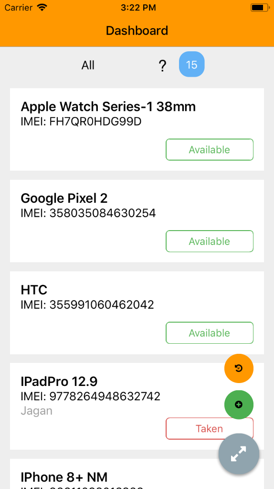
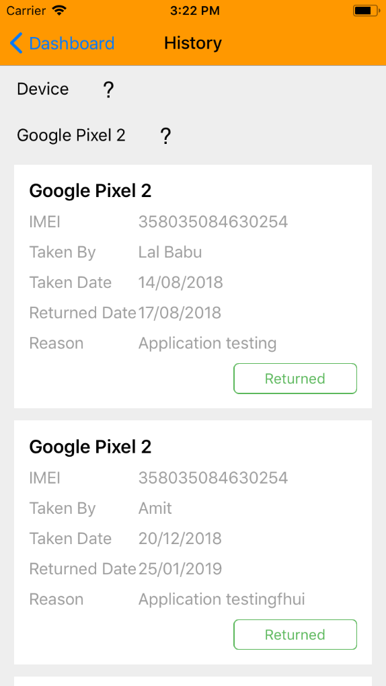
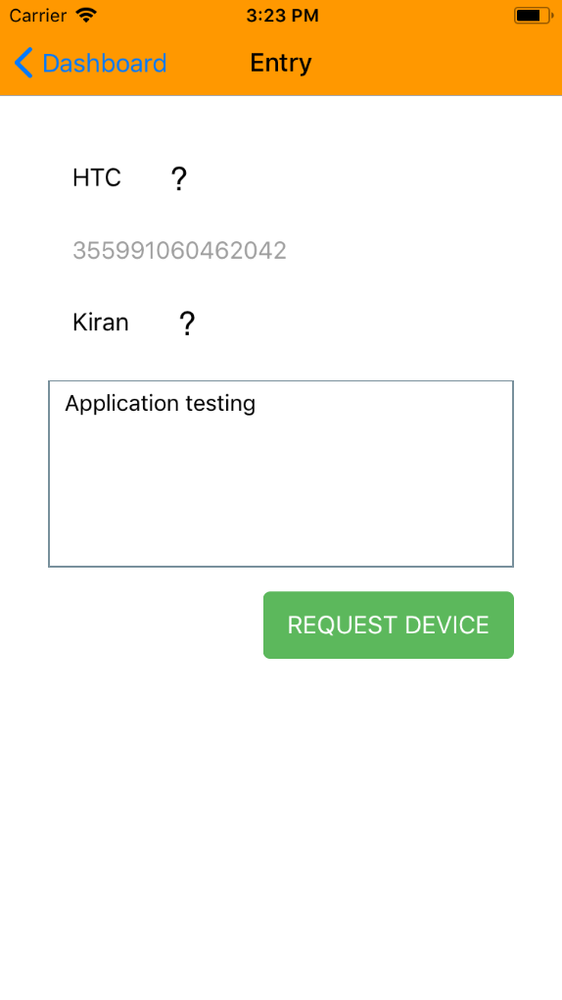
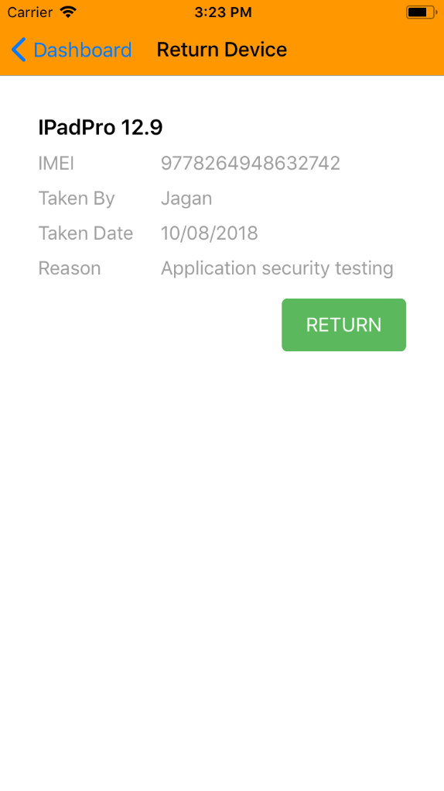

# device-tracker
This is a react-native project. This app is used to track device repository/stock, which will be helpful for mobility projects.

* Can see available/taken devices list in Dashboard screen.
* Can track history of devices usability.













### Prerequisites ###
* Node js (npm)
* Firebase real-time data base set up

### Setting up Firebase real-time database ###
Edit `sample-devices.json` file to create initial setup for devices list. Considering below constraints:
* Unique device name
* Unique device IMEI number

And set isAvailable field to:
* true - if device is availble
* false - if its taken

After updating `sample-devices.json` import it in real-time database.

### Update configuration keys of firbase ###

Pull `googe-services.json` file from google-api's project setup.

Update the `firebaseConfig` in `app\screens\dashboard.js` as 

```
const firebaseConfig = {
     //This need your firebase configs, which are the part of google-json
     apiKey: "<api key>",
     authDomain: "<auth domain ex: devicetracker.firebaseapp.com>",
     databaseURL: "<real-time database base url ex: https://devicetracker.firebaseio.com>",
     projectId: "<ex:devicetracker>",
     storageBucket: "<ex: devicetracker.appspot.com>",
     messagingSenderId: "<messaging id>"
})
```
